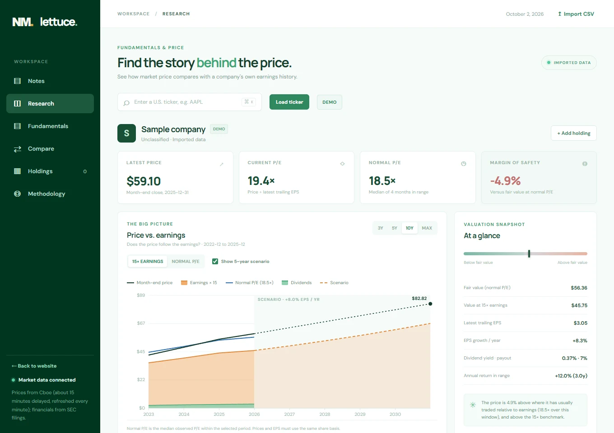

# Lettuce

A free research tool for long-term investors. It charts a company's share price against its real earnings and dividends from SEC filings, so you can see whether a stock looks cheap or expensive compared with its own history.

**Try it at [app.nathanielmann.ca/app](https://app.nathanielmann.ca/app).**



## Why I built it

I made an investment tool focused on providing information to be used for choosing stable long-term investments. It is an independent take on fundamentals-versus-price charts in the spirit of FAST Graphs, built entirely on free data. The branding, interface and valuation calculations are original, and no competitor data or code is used.

## Features

- **Price vs. earnings chart:** weekly closing price, an orange earnings area (trailing EPS × 15 or × the company's normal P/E), a green dividend area, a normal-P/E line and an optional five-year scenario. Windows of 3, 5 and 10 years or the full history.
- **Valuation at a glance:** current and normal P/E, fair value, margin of safety, EPS growth, dividend yield, payout ratio and annualized return.
- **Five-year scenario:** enter EPS growth and an exit P/E to see the implied price and total return.
- **What the company does:** the opening of "Item 1. Business" from the latest 10-K, with a link to the filing.
- **Fundamentals page:** growth, margins, ROIC, balance sheet, valuation multiples, cost of capital, a DCF, ten years of financial history and peer comparisons.
- **Head to head:** ten fiscal years of net income, EPS, dividends and share price against a company's closest competitor.
- **Holdings:** track positions in the browser, with prices refreshing every minute.
- Any U.S. company that files with the SEC, loaded on demand, plus CSV import for your own data.

## Tech stack

| Part | Tech |
| --- | --- |
| Server | Node.js 20 using only built-in modules (no npm dependencies) |
| Browser | Vanilla JavaScript, HTML, CSS and SVG charts. No build step. |
| Data | SEC EDGAR (filings), Cboe (prices) and FRED (Treasury yield and S&P 500). None need an API key. |
| Hosting | A Render web service at `app.nathanielmann.ca` |
| Tests | Node's built-in test runner (`node --test`) |

## How it works

| Data | Source | Notes |
| --- | --- | --- |
| Daily closing prices (split-adjusted) and the latest quote | [Cboe](https://www.cboe.com) delayed-quote data (`cdn.cboe.com/api/global/delayed_quotes/…`) | No key and no quota. History from 2004 in one request, kept as weekly and month-end closes. Quotes are about 15 minutes delayed. |
| Diluted EPS, dividends, revenue, margins, cash flow, debt, cash, equity, share counts, company name and industry | [SEC EDGAR](https://www.sec.gov/search-filings/edgar-application-programming-interfaces) XBRL company facts | Free, no key. Covers U.S. companies that file 10-K and 10-Q reports. |
| 10-year Treasury yield (risk-free rate) and S&P 500 month-end values (for beta only) | [FRED](https://fred.stlouisfed.org) CSV downloads (`DGS10`, `SP500`) | Free, no key. Refreshed daily. |

The server stores **raw** statement values, and every ratio is calculated in `math.js`, following `free_stock_dashboard_data_sources.md`. Keyless sources are used wherever possible. Alpha Vantage, Finnhub and FMP are not used. SEC filings cover everything they would have supplied except analyst estimates, which have no free source. Peers are entered by hand, since automatic peer lists need a keyed API.

**Caching and limits.** The server caches each company's filings and price history in memory for 24 hours. It fetches Cboe's quote at most once a minute per symbol, shared by every visitor, and uses it as the latest point. Each visitor may load 60 uncached companies per hour. If Cboe or the SEC can't be reached, previously loaded companies are served from the last fetch with a notice. In the browser, loaded tickers are cached for a week and the company description for 30 days.

### How the earnings line is built

1. Take every per-share fact for `EarningsPerShareDiluted` (falling back to `EarningsPerShareBasicAndDiluted`, then `EarningsPerShareBasic`) and the dividends-per-share tags, from 10-K and 10-Q filings.
2. **Detect stock splits.** Companies restate earlier per-share figures after a split. When at least two periods are restated by the same clean ratio (2, 3, 4, 10, 20, 50…), that is treated as a split occurring by the first restating filing. Every figure filed before a split is divided by the split ratio, so everything is on today's share basis, matching the split-adjusted prices.
3. For each period, keep the most recently filed value. Derive the fourth quarter as the fiscal year minus the nine-month year-to-date figure.
4. Trailing-twelve-month EPS at each quarter end is the fiscal-year figure (at year end) or the sum of four contiguous quarters. Values are linearly interpolated between quarter ends, like a blended P/E, and held flat after the latest report.

## Run locally

Requires Node.js 20 or newer. There are no npm dependencies, and no API keys are needed.

On Windows, double-click `start.cmd`. Otherwise run:

```bash
npm start
```

Open `http://127.0.0.1:4173/app`, enter a ticker such as `MSFT` and press **Load ticker**. You can link straight to a company with `/app?ticker=AAPL`, or load filings only with `/app?ticker=AAPL&depth=sec`.

Optionally copy `.env.local.example` to `.env.local` and set `SEC_USER_AGENT` to a name and contact email. The SEC asks automated clients to identify themselves this way. `.env.local` is ignored by Git and must never be committed.

## Tests

```bash
npm test
```

On Windows you can double-click `test.cmd`. The tests in `tests/` cover the calculations, the data provider, the Fundamentals page and access. Render runs them on every deploy.

## Limitations

- Earnings are GAAP, so one-time items such as write-downs or investment gains show up as spikes.
- Foreign filers using IFRS (20-F) aren't supported. Companies with several share classes report EPS per class, which may not match the traded ticker. Always check results for split-heavy companies.
- Cboe's quote data is unofficial: it's the data behind Cboe's own site, so it may change without notice.
- There are no analyst estimates, since they have no free source.
- Render's free plan spins down when idle, which clears the in-memory cache.
- These calculations are a research aid, not a forecast or recommendation. A company's historical multiple can be a poor guide to its future multiple.

## Reference

### Load ticker

**Load ticker** reads the SEC filings and the full price history together. If Cboe has no prices for a ticker, the SEC data still loads and a **Load prices** button lets you retry. Prices for the open ticker and every holding refresh every minute while the tab is visible. Holdings are saved in the browser's local storage.

### Fundamentals page

- **Growth:** 5- and 10-year CAGR of revenue and diluted EPS; 5-year CAGR of FCF per share, dividends and diluted share count.
- **Profitability:** gross, operating and FCF margins; ROIC = operating income × (1 − effective tax rate) ÷ average (debt + equity − cash).
- **Balance sheet:** cash plus short-term investments, debt (borrowings plus commercial paper, excluding leases), net debt, and debt ÷ TTM FCF.
- **Valuation:**
  - market cap = price × cover-page shares outstanding (diluted shares for multi-class filers)
  - EV = market cap + debt − cash
  - trailing P/E, P/FCF, FCF yield, EV/EBIT and EV/EBITDA
- **Cost of capital:**
  - CAPM cost of equity = 10-year Treasury + Blume-adjusted beta × equity risk premium (5% default, editable). Beta uses 60 months against the S&P 500.
  - Pre-tax cost of debt = interest expense ÷ average debt. If interest isn't reported, it's the 10-year Treasury + 1.5%.
  - WACC, and ROIC − WACC.
- **DCF:** two-stage free cash flow per share. Five years at the chosen growth rate, five years fading to terminal growth, then a Gordon terminal value, discounted at WACC. All inputs are editable.
- **Head to head:** ten fiscal years of net income, diluted EPS, dividends per share and year-end share price for the company and its closest competitor, with growth rates for each. Fiscal years are matched by label, and the year-end price is the close nearest each fiscal year end.
- **Financial history:** ten fiscal years of the raw and derived values.
- **Peers:** the same metrics for tickers you add.

Trailing-twelve-month flows are last fiscal year + this year-to-date − the same year-to-date a year earlier.

### Calculation rules

For the selected window, each observation with positive EPS gives a P/E of `price / eps`. Ratios outside 2–100 are excluded, and the median of the rest is the normal P/E. Fair value equals trailing EPS times the normal P/E. The orange earnings area uses 15× EPS by default, a long-standing benchmark for a fairly valued business. Margin of safety is `1 - latest price / fair value`; a negative result means price is above that benchmark.

EPS CAGR uses the first and latest positive EPS in the window. Annual return in range is the price change plus dividends received (not reinvested), annualized. The scenario compounds the latest EPS at the entered growth rate for five years and applies the entered exit P/E (normal P/E by default). The "with dividends" figure adds dividends at the current payout ratio.

### Import your own data

Select **Import CSV** and supply a ticker, company name and file. The header must include `date,price,eps`; `dividend` is optional and means trailing twelve-month dividends per share. Dates must be `YYYY-MM-DD`, prices positive, and there must be at least two rows with unique dates. See [`sample-data.csv`](sample-data.csv).

The EPS column means *trailing twelve-month diluted EPS* for the observation date. Price and EPS must be on the **same share basis** across splits. Imported data stays in the current browser and is not sent to a server.

### Access and Notes

Lettuce and its API are public and require no password, including on Render. Any existing `APP_PASSWORD` setting is ignored. `/app` opens the Notes page, which explains the data flow and Canadian stock coverage. Sidebar links and direct ticker links still open their requested views.

## Deploy on Render

The repo includes `render.yaml` for a Render **web service** named `lattice-investment-tool`. Every push to `main` redeploys it. The homepage, [nathanielmann.ca](https://nathanielmann.ca), is a separate Render service in its own repository, [nmann06/homepage](https://github.com/nmann06/homepage), so changes there never redeploy the tool.

1. In Render, create a new **Blueprint** from the GitHub repository. It defines a free Node web service, runs the tests during build and checks `/health`.
2. `FINANCIALDATA_API_KEY` is no longer used and can be left empty. Set `SEC_USER_AGENT` to something like `Lettuce research you@example.com`. These values live only in Render's environment settings, never in the repository.
3. The Blueprint adds `app.nathanielmann.ca` as a custom domain. Add the CNAME record Render shows at your DNS provider, and keep any unrelated records intact.

Render runs the server on its assigned `PORT` and host `0.0.0.0`.
